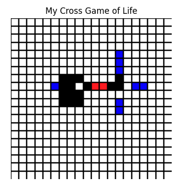
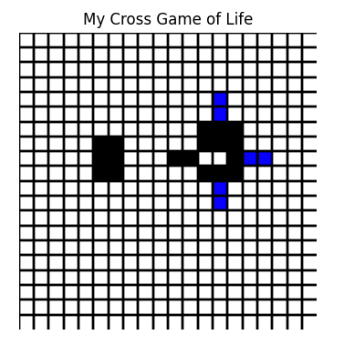
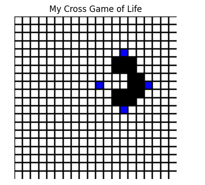
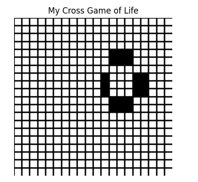
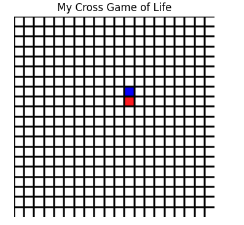
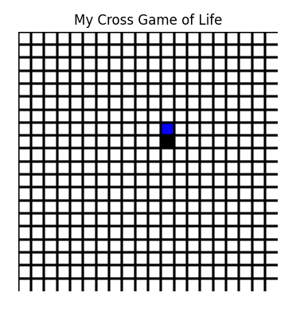
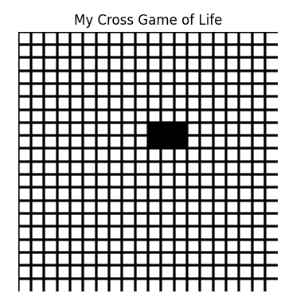
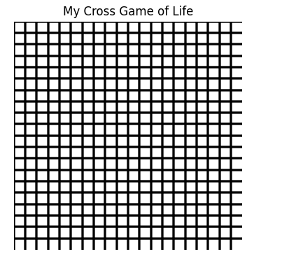

# CrossFinder: A Custom Game of Life Variant

CrossFinder is an innovative variant of Conway's Game of Life, meticulously engineered to detect and manipulate cross shapes within a grid environment. Diverging from the conventional Game of Life, CrossFinder integrates additional states and tailor-made rules aimed at pinpointing and transforming cross-shaped patterns.

This ingenious program was conceived as a response to problem 28 in the seminal book **Biological Computation** by Ehud Lamm and Ron Unger. It was developed as a key component of the "Biological Computation" course at the Open University of Israel. The solution, amalgamated with another program ([simulationEarth](https://github.com/Dor-sketch/SimulationEarth)), was submitted and acclaimed with a perfect score of 100.

<p align="center">
  
    <p align="center">
        <i>Algorithm identify target '+' shape</i>
    </p>

---

<!-- @import "[TOC]" {cmd="toc" depthFrom=1 depthTo=6 orderedList=false} -->

<!-- code_chunk_output -->

- [CrossFinder: A Custom Game of Life Variant](#crossfinder-a-custom-game-of-life-variant)
  - [Features](#features)
  - [How It Works](#how-it-works)
    - [Rules Overview](#rules-overview)
  - [How to Run](#how-to-run)
  - [Usage](#usage)
  - [Runing Examples](#runing-examples)
    - [Example 1](#example-1)
    - [Example 2](#example-2)
    - [Example 3](#example-3)
  - [License](#license)

<!-- /code_chunk_output -->

---

## Features

- Grid-based simulation where each cell can be in one of four states:
  - `0`: Dead
  - `1`: Alive
  - `2`: Red, marking cells that are part of a cross or interact with cross shapes
  - `3`: Blue, indicating the propagation of a wave from the edges of a cross towards its center
- Custom rules to detect and highlight cross shapes within the grid
- Functionality to visualize the detection and processing of crosses in real-time

## How It Works

<p align="center">
  
    <p align="center">
        <i>Visualization of the CrossFinder simulation waves</i>
    </p>
</p>

The CrossFinder program operates on a grid where cells can transition between states based on their neighbors. The primary focus is on identifying and marking cross shapes. A cross is defined as a vertical and horizontal line intersecting at a central cell, all of which are alive (`1`). When a cross is detected, the cells constituting the cross transition to the state `2` (red), signifying the first wave of detection.

### Rules Overview

- The first wave (`2` state) targets cells that form the cross structure. When a pattern matching a part of the cross is found, those cells transition to the red state.
- The second wave (`3` state) begins at the edges of the cross and moves towards the center, marking the progression of the detection process.

## How to Run

The program was tested on python `3.11` and requires the following packages:

- `numpy`: For grid manipulation and operations

- `matplotlib`: For visualization

---

Use the following command to run the program:

```bash
    python3 cross_game.py
```

If more than one python version is installed, try use the following command:

```bash
    python3.11 cross_game.py
```

---

## Usage

The program support both randomized initial states (press `reset` button) and user interactive controls (press the matrix cells to change their state).

For the next generation, press `next Day` button.

<p align="center">
  
</p>

## Runing Examples

### Example 1

| Initial state | 2 | 3 | 4 | *Finale state* |
| - | - | - | - | - |
|  |  |  |  |  |

---

### Example 2

Initial state - 2nd example: 2 valid crosses in different sizes

| Initial state | 2 | 3 | *Finale state* |
| - | - | - | - |
|  |  |  |  |

---

### Example 3

Complex destruction exmp - no valid crosses

| 1 | 2 | 3 | 4 |
| - | - | - | - |
|  |  |  |  |

| 5 | 6 | 7 | 8 |
| - | - | - | - |
|  | |  |  |

|  10 | 11 | 12 | *Finale state* |
| - | - | - | - |
|  |  |  |  |

---

## License

This project is licensed under the MIT License - see the [LICENSE](./LICENSE) file for details.
